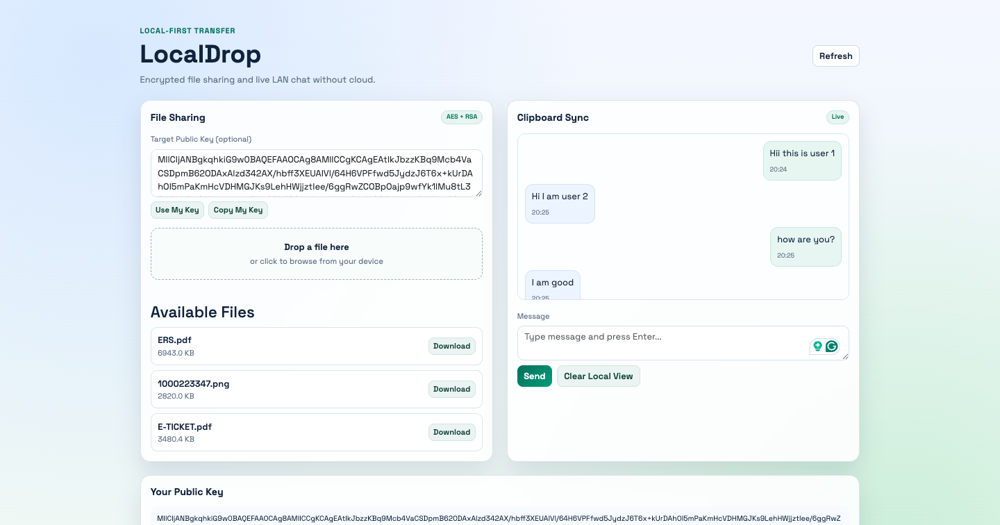

# LocalDrop

LocalDrop is a local-network sharing app for encrypted file transfer and real-time chat. It is designed to work inside the same Wi-Fi, LAN, or hotspot network without cloud dependency. A single Spring Boot server hosts both the backend APIs and the web UI, and multiple devices can join using the server IP and port.

## Motivation

I built this project mainly to learn how real-time communication works using WebSockets, similar to chat systems like WhatsApp at a conceptual level. I also wanted to understand how backend services, browser clients, and network events stay synchronized in live communication flows. Along the way, I explored secure file transfer patterns using hybrid encryption (AES for file content and RSA for key exchange).

## UI Preview



## Tech Stack

The backend uses Java 17+ with Spring Boot, Spring Web, and Spring WebSocket. The frontend is plain HTML, CSS, and JavaScript served from Spring static resources. Cryptography uses Java Crypto APIs with RSA and AES. Build and dependency management are handled with Maven.

## Encryption Details and Definitions

This project uses **hybrid encryption**, which means two algorithms are used together to balance speed and secure key exchange. The actual file content is encrypted with AES, and the AES key is encrypted with RSA. This is a standard pattern used in many secure systems because RSA alone is expensive for large data, while AES is fast for large binary files.

**AES (Advanced Encryption Standard)** is a symmetric encryption algorithm. Symmetric means the same key is used to encrypt and decrypt data. In LocalDrop, a fresh AES key is generated per upload and used to encrypt file bytes before storage. This keeps the file payload protected at rest in `storage/*.data`.

**RSA (Rivest-Shamir-Adleman)** is an asymmetric encryption algorithm. Asymmetric means it uses a key pair: a public key (shareable) and a private key (secret). In LocalDrop, RSA is used to encrypt the generated AES key. That encrypted AES key is stored separately in `storage/*.key`. Only the matching private key can recover the AES key.

**Public Key** in this project is the key you can share safely with peers. It is used only for encryption, not decryption. **Private Key** is stored locally (`config/private.key`) and must never be shared, because it is required to decrypt AES keys and therefore open encrypted files.

During upload, the server picks the effective target public key, generates AES key material, encrypts file data with AES, encrypts AES key with RSA, and writes both encrypted outputs. During download, the server decrypts the AES key using private RSA key and then decrypts file content with AES. This is why wrong or invalid target-key text causes upload errors: RSA public key parsing fails before secure key wrapping can complete.

## Reliable Messaging and Tick Status

The chat layer now uses a typed WebSocket event protocol instead of plain text messages. Each chat message carries a `messageId`, `senderId`, `senderName`, `timestamp`, and `content`. The server maintains in-memory message state and tracks acknowledgements from recipients. This enables three delivery states for sender-side status rendering: `sent`, `delivered`, and `read`.

The UI maps those states to WhatsApp-style ticks. A single gray tick (`✓`) means the message reached the server and was accepted (`sent`). A double gray tick (`✓✓`) means at least one intended recipient acknowledged receipt (`delivered`). A double blue tick (`✓✓` in blue) means recipients acknowledged read while the chat view was visible (`read`).

When a client disconnects and reconnects, it sends a sync request with its last known timestamp. The server responds with missed messages and updated status snapshots. This allows old messages to move from single tick to double/blue tick later when an offline recipient comes back and acknowledges.

## High-Level Design

The system has three simple layers: the browser UI, the Spring Boot application layer, and local filesystem storage. Clients access `http://<server-ip>:8080`, then communicate with REST endpoints for file and key operations and with WebSocket for live messages. Files are stored in encrypted form under `storage/`, and runtime key material is managed in `config/`.

The current operating model is single-server, multi-client. This means all connected devices talk to one running LocalDrop instance, which keeps chat session state in memory and keeps encrypted files on disk.

## Low-Level Design

`FileController` handles upload, list, and download requests and delegates logic to `FileService`. `FileService` encrypts uploaded files, stores `.data` and `.key` files, reads and decrypts files for download, and emits refresh events to connected clients. `KeyController` and `EncryptionService` expose and manage RSA public-key operations. `ClipboardController` and `ClipboardService` handle WebSocket event processing, session identity tracking, delivery/read acknowledgements, and bounded in-memory chat history. `ChatController` provides `/api/chat/history` and `/api/chat/sync` for refresh and reconnect recovery.

`RSAUtil` manages public/private key lifecycle and RSA operations, while `EncryptionUtil` handles AES key generation plus encryption and decryption helpers.

## Complete Flow (Start to End)

When the server starts, Spring initializes REST APIs, static file serving, and the `/clipboard` WebSocket endpoint. When a user opens the page, the frontend loads file metadata, server public key, and chat history, then opens a WebSocket connection. The client identifies itself with a local device ID and nickname and sends a sync request to recover missed events.

During file upload, the browser sends the file with an optional target public key. If target key is empty, backend falls back to the local server public key (single-server convenience). The server encrypts file bytes with AES, encrypts the AES key with RSA, saves encrypted artifacts, and broadcasts a refresh signal. Other clients receive this signal and refresh file list.

During file download, the backend reads encrypted file and key artifacts, decrypts the AES key using local private key, decrypts file bytes, and returns the file response. During chat send, the server stores the message and marks it as `sent`, then delivers to recipients and updates state as acknowledgements arrive. Recipients send `delivery_ack` once rendered and `read_ack` when visible, allowing status progression to `delivered` and `read`. After refresh, the frontend fetches `/api/chat/history`; after reconnect, it requests sync so missed messages and older status updates are restored.

## Public Key and Target Key Clarification

`Your Public Key` is the server's public RSA key. `Target Public Key` is the key used to encrypt the AES file key for upload. In your current single-server use case, you can leave target key empty or click `Use My Key`. Upload fails only when an invalid key text is entered (for example `hi`) because it is not valid Base64 RSA key data.

## Project Structure (Current)

```text
src/main/java/com/localdrop/
  config/
  controller/
  model/
  repository/
  service/
  util/
src/main/resources/
  application.properties
  static/
    index.html
    assets/css/style.css
    assets/js/main.js
src/test/java/com/localdrop/
storage/
```

## Running the Project

Start from the module directory using `mvn spring-boot:run`. Open `http://localhost:8080` on the host machine. For another device, open `http://<host-local-ip>:8080` while both devices are on the same network and firewall rules allow port 8080.

## GitHub Push Safety

Before pushing, make sure generated and runtime artifacts are not committed. Build output in `target/`, private key files in `config/`, and runtime encrypted payloads in `storage/` should stay local only. Source files, static assets, tests, and documentation are safe to push.

## Learnings

This project taught me practical WebSocket lifecycle handling, including connection setup, message broadcast, reconnection behavior, and refresh-safe history restoration. It also improved my understanding of end-to-end flow design where frontend state, backend service orchestration, and local network constraints must align for a smooth user experience.

I also learned the importance of designing developer and user clarity together. Features like optional key fallback, clearer chat/file sync flow, and better UI structure reduce confusion and make the system easier to operate and explain.

## License

MIT License.
